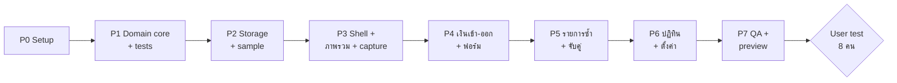

# 04 — Build Plan

v0 แบ่งเป็น 7 เฟส แต่ละเฟสจบด้วยสิ่งที่ทดสอบได้ ทำตามลำดับ ห้ามข้ามเฟส 1
ระยะเวลาในตารางเป็น **ค่าประมาณ** สำหรับคนเดียวทำร่วมกับ Claude Code ยังไม่ได้วัดจริง

## ภาพรวม

| เฟส | ส่งมอบ | ประมาณ | ผ่านเมื่อ |
|---|---|---|---|
| P0 | repo, tooling, CI script | 0.5 วัน | `dev`, `test`, `typecheck`, `lint` รันได้ |
| P1 | `src/domain/*` + tests | 1.5–2 วัน | G1–G12 และ P1–P18 ผ่านทั้งหมด |
| P2 | repository, zod, seed, migration | 0.5–1 วัน | A-D1…A-D4 |
| P3 | app shell, nav, ภาพรวม, แถบพิมพ์, sheet ร่าง | 1.5–2 วัน | A-1…A-6 |
| P4 | เงินเข้า-ออก, ฟอร์มเต็ม, ลบ/เลิกทำ | 1 วัน | A-7…A-10 |
| P5 | รายการซ้ำ, occurrence actions, จับคู่, trial | 1.5 วัน | A-11…A-15 |
| P6 | ปฏิทิน, เป้าและตั้งค่า, บัญชี, export/import | 1–1.5 วัน | A-16…A-21 |
| P7 | e2e ครบ, a11y, 390/1280, Vercel preview | 1 วัน | `docs/05-acceptance.md` ทั้งหมด |

---

## P0 — Setup

- [x] `create-next-app` (TS, App Router, Tailwind, ESLint, `src/`)
- [x] เพิ่ม vitest, @testing-library, playwright, zod
- [x] `tsconfig` strict + path alias `@/`
- [x] scripts: `dev`, `build`, `test`, `test:e2e`, `typecheck`, `lint`
- [x] ใส่ design tokens จาก `01-product-brief.md` §8 ใน `globals.css` + fonts ผ่าน `next/font`
- [x] อัปเดตส่วน Commands ใน `CLAUDE.md`
- [x] สร้าง `docs/decision-log.md` (ว่าง พร้อม template: วันที่ · เรื่อง · ตัดสิน · เหตุผล)

## P1 — Domain core (ห้ามมี React)

- [x] `money.ts` — parse ยอดจาก string → minor, format THB/USD/EUR, `toThbMinor`, round half away from zero
- [x] `dates.ts` — parse/format `LocalDate`, add days/months แบบ clamp, วันไทยย่อ (`5 ต.ค.`), พ.ศ.↔ค.ศ.
- [x] `cycle.ts` — `cycleFor(date, startDay)`, ป้ายรอบ, เลื่อนรอบ
- [x] `recurrence.ts` — `occurrences(rule, from, to)`, สถานะ matched/upcoming/overdue
- [x] `totals.ts` — รับจริง, จ่ายจริง, สุทธิ, จะตัดอีก, จะเข้าอีก, งานเสริม, breakdown หมวด/บัญชี, ตัวกรอง scope
- [x] `matching.ts` — หา occurrence ที่น่าจะตรงกับร่าง (±3 วัน, ชื่อ)
- [x] `insights.ts` — ความเห็นจากสมุด (คืนเฉพาะข้อที่คำนวณได้ พร้อม id รายการต้นทาง)
- [x] `parser/` — ตาม `03-parser-spec.md`
- [x] tests: G1–G12, P1–P18 + edge cases ที่เจอระหว่างทำ

## P2 — Storage และข้อมูลตัวอย่าง

- [x] zod schemas ตรงกับ types ใน `02-domain-rules.md` §2
- [x] `Repository` interface (`load`, `save`, `reset`, `exportJson`, `importJson`) + `LocalStorageRepository`
- [x] อ่านเสีย → สำรอง raw + เริ่มสมุดว่าง + ธงให้ UI แสดงแบนเนอร์ · localStorage ใช้ไม่ได้ → in-memory + ธง
- [x] seed ตัวอย่าง **สร้างวันที่สัมพันธ์กับ today** ให้อยู่ในรอบปัจจุบัน:
  - รายรับ: เงินเดือน 45,000 (เกิดแล้ว), งานพาร์ตไทม์ 8,000 (rule รายเดือน, ยังไม่ถึง), งานเสริม 4,500 (เกิดแล้ว)
  - rules: Netflix, YouTube, Claude (USD), ChatGPT (USD), Notion (USD), Google One, Spotify, Fitness, ค่าเช่า, Perplexity (trial เหลือ ~7 วัน)
  - รายจ่ายครั้งเดียว: อาหาร/เดินทาง 6–10 รายการ, 1 transfer (จ่ายบัตร), 1 refund
  - บางบิลในรอบนี้ matched แล้ว บางบิลยัง upcoming
  - ทุก transaction `source: "sample"` · `note: "ตัวอย่าง ไม่ใช่ยอดจริง"`
- [x] state store ฝั่ง client (React context + reducer หรือ zustand) ที่เรียก domain functions

## P3 — Shell, ภาพรวม, แถบพิมพ์

- [x] layout: header + แถบพิมพ์ + bottom nav (<900px) / sidebar (≥900px)
- [x] แบนเนอร์ตัวอย่าง + `เริ่มสมุดของฉัน`
- [x] ภาพรวมตาม §5.3 (4 ตัวเลข, งานเสริม, trial, ใกล้ตัด 7 วัน, เลยกำหนด, บัญชี, ความเห็น)
- [x] แถบพิมพ์ + sheet ยืนยันร่าง (หลายร่าง, ช่อง uncertain, คำถามบังคับ, เสนอจับคู่)
- [x] toast + เลิกทำ

## P4 — เงินเข้า-ออก

- [x] รายการจัดกลุ่มตามวัน, ชิปกรอง, ค้นหา, เลื่อนรอบ, ผลรวมตามตัวกรอง
- [x] ฟอร์มเต็ม (สร้าง/แก้) ทุกชนิดรวม transfer (จาก → ไป) และ refund (เลือกรายการเดิมได้)
- [x] soft delete + เลิกทำ

## P5 — รายการซ้ำ

- [x] รายการ rules (การ์ดมือถือ / ตารางเดสก์ท็อป), สรุปต่อเดือน/ปี
- [x] ฟอร์ม rule: รอบ, startsOn, endsOn, maxOccurrences, trialEndsOn, บัญชี, หมวด
- [x] แก้ rule มีผลกับครั้งต่อไปเท่านั้น · เลิกใช้ = ตั้ง endsOn
- [x] ปุ่ม `จ่ายแล้ว` / `ได้รับแล้ว` / `ข้ามรอบนี้` บน occurrence
- [x] แสดง diff ยอดจริงกับคาดการณ์ · ยกเลิกการจับคู่

## P6 — ปฏิทินและตั้งค่า

- [ ] ปฏิทินเดือน (จริงทึบ / คาดการณ์เส้นประ), วันหนักสุด, รายการของวันที่เลือก, โหมดจอแคบ
- [ ] เป้างานเสริม, วันเริ่มรอบ, เรท, ป้ายงาน
- [ ] จัดการบัญชี (ห้ามช่องเลขเต็ม)
- [ ] ส่งออก JSON/CSV (UTF-8 BOM), นำเข้า JSON (ยืนยันก่อนทับ), โหลดตัวอย่าง, ล้างข้อมูล

## P7 — QA และ preview

- [ ] Playwright ครบตาม `05-acceptance.md` ที่ 390×844 และ 1280×800
- [ ] a11y: axe ไม่มี violation ระดับ serious/critical, keyboard ครบ flow
- [ ] ตรวจ copy เทียบ §7 ของ product brief
- [ ] Deploy preview บน Vercel — **Grape เป็นคนกดเอง** Claude Code เตรียม config และวิธีทำให้
- [ ] สรุปผล: ผ่าน/ไม่ผ่านรายข้อ + สิ่งที่ยังไม่ได้ทำ

---

## หลัง v0 (ยังไม่ทำจนกว่าผล user test ออก)

| Version | เนื้อหา | เงื่อนไขเริ่ม |
|---|---|---|
| **v0.1** | AI แยกข้อความ (route handler + Vercel AI SDK, consent ก่อนใช้ครั้งแรก, ปิดได้) · งบรอบ + "ใช้ได้อีกวันละ" · ประวัติแก้ไข · dark mode | user test ผ่าน + parser baseline วัดแล้ว |
| **v0.2** | อ่านสลิป/ใบเสร็จ (K PLUS, SCB, Krungthai, TrueMoney) · ภาพไม่เก็บ · privacy notice ตาม PDPA | eval สลิปจริง 50 ใบ: ยอดถูก ≥ 95%, วันที่ ≥ 90%, ผู้รับ ≥ 85% |
| **v0.3** | Supabase auth + sync (RLS ต่อผู้ใช้) · ย้ายข้อมูลจากเครื่องขึ้นบัญชี · PWA · แจ้งเตือน | มีผู้ใช้ pilot ขอใช้ข้ามอุปกรณ์ |
| later | นำเข้า CSV ธนาคาร · งบต่อหมวด · ยอดคงเหลือต่อบัญชี · LINE | ตามหลักฐาน |
