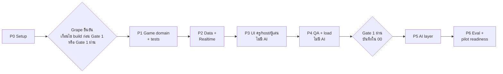

# 05 — Build Plan

วันที่: 26 ก.ย. 2026 · v0 แบ่ง 7 เฟส ทำตามลำดับ แต่ละเฟสจบด้วยสิ่งที่ทดสอบได้
ระยะเวลาเป็น **ค่าประมาณ** สำหรับ Grape ทำร่วมกับ Claude Code ยังไม่ได้วัดจริง

## ภาพรวมและ gate

| เฟส | ส่งมอบ | ประมาณ | ผ่านเมื่อ | Gate |
|---|---|---|---|---|
| P0 | repo, tooling, Supabase scaffold | 0.5–1 วัน | `dev` `test` `typecheck` `lint` รันได้ | ไม่มี |
| P1 | `src/domain/*` + unit tests | 1–1.5 วัน | D1–D10 ผ่าน | Phase A |
| P2 | schema + RLS, route handlers, realtime | 1.5–2 วัน | R1–R8 ผ่าน | Phase A |
| P3 | หน้าครู, host, ผู้เล่น (สร้างคำถามเอง) | 2–3 วัน | U1–U10 ผ่าน | Phase A |
| P4 | e2e, load, a11y, preview config | 1 วัน | Q1–Q7 ผ่าน | Phase A |
| P5 | AI ร่างคำถาม/มโนทัศน์/คลังข้อทบทวน | 1.5–2 วัน | AI1–AI6 ผ่าน | **Gate 1** |
| P6 | eval harness, ผล eval, pilot checklist | 1–1.5 วัน | เป้า eval ใน `01` §8 หรือรายงานช่องว่าง | **Gate 1** |

---

## P0 — Setup

- [ ] Scaffold Next.js (TS, App Router, Tailwind, ESLint, `src/`) ด้วย Bun — `create-next-app` อาจไม่ยอมลงในโฟลเดอร์ที่มีไฟล์อยู่แล้ว ให้ scaffold ในโฟลเดอร์ชั่วคราวแล้วย้ายเข้ามา **ห้ามทับ** `CLAUDE.md`, `README.md`, `docs/`, `prompts/`
- [ ] Tailwind v4, shadcn/ui init, framer-motion, zod, vitest + @testing-library, playwright, `@axe-core/playwright`
- [ ] `tsconfig` strict + alias `@/`
- [ ] scripts: `dev`, `build`, `test`, `test:e2e`, `typecheck`, `lint`
- [ ] `supabase init` + โฟลเดอร์ migrations (ยังไม่ link project จริง)
- [ ] `.env.example` (ดูหัวข้อ Env ด้านล่าง) · `.gitignore` ครอบ `.env*.local`
- [ ] ฟอนต์ที่รองรับไทยผ่าน `next/font` (เลือกแล้วบันทึกใน `docs/decision-log.md`)
- [ ] เติมส่วน Commands ใน `CLAUDE.md`
- [ ] `git init` + commit แรก

## P1 — Game domain (TypeScript ล้วน ห้ามมี React/Supabase)

- [ ] `session-machine.ts` — สถานะ: `lobby → question_open → question_closed → reveal → (top5) → … → podium → review_map → review_open → review_closed → review_reveal → summary → ended` + `paused` · ฟังก์ชัน transition ที่ปฏิเสธการเปลี่ยนสถานะผิดลำดับ
- [ ] `scoring.ts` — โหมด `accuracy` (ถูก = คะแนนคงที่) และ `speed` (ลดตามเวลาที่ใช้ มีเพดานล่าง) · สูตรบันทึกใน decision-log · รอบทบทวนไม่คิดคะแนน
- [ ] `review-selection.ts` — ตาม `03` §3.3 ทุกข้อ: base < 5 ตัดทิ้ง, เด่น ≥ 20%, top 3, เติมจากคลัง, กรณีไม่มีจุดเด่น, tie-break (ความแม่นของข้อหลักต่ำกว่าก่อน แล้วค่อยลำดับ conceptId) · threshold เป็น config
- [ ] `readiness.ts` — เปิดเกมได้เมื่อ: ข้อหลักอนุมัติครบ, คลังข้อทบทวนอนุมัติ ≥ 3, ตัวลวงทุกตัวมี conceptId, มโนทัศน์ ≤ 5, ข้อหลักมีเฉลย + เหตุผล · คืนรายการเหตุผลที่ยังเปิดไม่ได้ (ใช้แสดงใน UI)
- [ ] `names.ts` — ตรวจชื่อเล่น/ชื่อกลุ่ม (ความยาว, normalize ช่องว่าง/zero-width, ซ้ำแบบ case-insensitive, คำไม่สุภาพพื้นฐานไทย/อังกฤษ)
- [ ] `pin.ts` — PIN 6 หลัก

**ผ่านเมื่อ**
- D1 transition ผิดลำดับถูกปฏิเสธ
- D2–D3 คะแนนสองโหมดตรงกับสูตร · คำตอบหลังปิดรับได้ 0
- D4 concept ที่ base < 5 ไม่ถูกเลือก
- D5 มีเด่น ≥ 3 → เลือก 3 อันดับแรกถูก
- D6 เด่น < 3 → เติมจากคลังตาม wrongShare
- D7 ไม่มีเด่น → คืนสถานะ "ไม่มีจุดเด่น"
- D8 tie-break ถูกต้อง
- D9 readiness คืนเหตุผลครบทุกกรณี
- D10 names ปฏิเสธชื่อซ้ำ/ว่าง/ไม่สุภาพ

## P2 — Data + Realtime

- [ ] Migrations ตาม `01` §9: `quizzes`, `concepts`, `questions`, `sessions`, `players`, `answers` · `unique(player_id, question_id)` · ไม่มีคอลัมน์ PII
- [ ] RLS: ครูเห็นเฉพาะ quiz/session ของตัวเอง · client ฝั่งผู้เล่นอ่าน/เขียนตาราง `players` และ `answers` ตรงๆ ไม่ได้
- [ ] ตัวตนผู้เล่น: server ออก token สุ่ม (เก็บเป็น hash) ใน httpOnly cookie ผูกกับ session · ใช้ rejoin ได้
- [ ] Route handlers: `join`, `answer` (ใช้ server timestamp, idempotent), คำสั่ง host (`start`, `close`, `reveal`, `next`, `pause`, `kick`, `swapReviewItem`, `end`) ทุกคำสั่งผ่าน `session-machine`
- [ ] Realtime: channel ต่อ session · server ส่ง state event ไปผู้เล่น · Presence สำหรับนับคนใน lobby · host ได้จำนวนคนตอบแบบ throttle (≤ 2 ครั้ง/วินาที)
- [ ] เวลาปิดรับคำนวณที่ server

**ผ่านเมื่อ**
- R1 ผู้เล่นอ่านคำตอบของคนอื่นไม่ได้ (ทดสอบ RLS)
- R2 ส่งคำตอบซ้ำไม่เกิดแถวที่สอง
- R3 คำตอบหลังเวลาปิดถูกปฏิเสธ
- R4 ผู้เล่นที่ถูก kick ส่งคำตอบไม่ได้
- R5 rejoin ด้วย token เดิมกลับมาที่สถานะปัจจุบัน
- R6 คำสั่ง host ผิดลำดับถูกปฏิเสธ
- R7 host ที่ไม่ใช่เจ้าของ session สั่งไม่ได้
- R8 ไม่มีการ broadcast คำตอบรายคนไปผู้เล่น

## P3 — UI (ไม่มี AI ครูเขียนคำถามเอง)

- [ ] ครู: Google login, รายการ quiz, editor (ข้อหลัก + มโนทัศน์ + คลังข้อทบทวน), สถานะรอตรวจ/อนุมัติ, แผงความพร้อม, เลือกโหมดผู้เล่น/คะแนน
- [ ] Host (16:9): lobby (PIN, QR, รายชื่อ, `เอาออกจากเกม`), คำถาม, เฉลย, top 5, podium, จุดที่ควรทบทวน, รอบทบทวน (`เปลี่ยนข้อ`), สรุป · คีย์ลัด `Enter` / `M` / `Esc`
- [ ] ผู้เล่น (มือถือ): ใส่ PIN → ชื่อเล่น/ชื่อกลุ่ม → รอ → ตอบ → ส่งแล้ว (หลัง ack) → เฉลย → รอบทบทวน → จบ · สถานะเน็ตหลุด/กลับมา/หมดเวลา
- [ ] ข้อความรวมไว้ที่ `src/copy/th.ts` จากตาราง ChatGPT §5 + การเปลี่ยนใน `03` §4
- [ ] Game feel ตาม ChatGPT §6 + reduced motion

**ผ่านเมื่อ**
- U1 เปิดเกมไม่ได้เมื่อยังมีข้อรอตรวจ หรือคลังข้อทบทวน < 3 และแสดงเหตุผล
- U2 แก้ข้อที่อนุมัติแล้ว → สถานะกลับเป็นรอตรวจ
- U3 เล่นครบวงจรรายคนได้ · U4 เล่นครบวงจรโหมดกลุ่มได้
- U5 จอ host ไม่มีชื่อนักเรียนในหน้าจุดที่ควรทบทวน
- U6 รอบทบทวนไม่แสดงอันดับ
- U7 "ส่งคำตอบแล้ว" แสดงหลัง ack เท่านั้น
- U8 ไม่มีคำว่า "ซ่อม" ใน UI (มี test ค้นใน `src/copy`)
- U9 ตัวเลือกแสดงตัวอักษร + รูปทรง + ข้อความ
- U10 reduced motion ปิด animation ตามสเปก

## P4 — QA (ไม่มี AI)

- [ ] Playwright: เกมเต็ม 40 ผู้เล่น (multi-context), โหมดกลุ่ม, หลุดกลางข้อแล้วกลับมา, kick, ชื่อซ้ำ, เข้าระหว่างเกม, ตอบหลังหมดเวลา
- [ ] สคริปต์ load: 40 และ 80 ผู้เล่นพร้อมกัน วัด msg/s เทียบเพดานแผน Supabase ที่ใช้
- [ ] a11y: axe ไม่มี serious/critical · host flow ด้วยคีย์บอร์ด · ผู้เล่น 390×844 · host 1280×720 และ 1920×1080
- [ ] เตรียม config + ขั้นตอน Vercel preview — **Grape เป็นคน deploy เอง**

**ผ่านเมื่อ**
- Q1 เกม 40 คนไม่มีคำตอบหาย
- Q2 msg/s สูงสุดอยู่ใต้เพดานแผน (บันทึกตัวเลขที่วัดได้จริง)
- Q3 reconnect ผ่าน
- Q4 axe ผ่าน
- Q5 keyboard ผ่าน
- Q6 ทุก viewport ผ่าน
- Q7 รายงาน tested / not tested

---

## ⛔ Gate 1 — ห้ามเริ่ม P5 จนกว่า `docs/00-decision-review.md` จะบันทึกว่า Gate 1 ผ่าน

## P5 — AI layer

- [ ] Input: วางข้อความ / PDF แบบข้อความ (จำกัดจำนวนหน้า, ตรวจ PDF สแกน)
- [ ] Vercel AI SDK structured output (zod): ข้อหลัก, มโนทัศน์ ≤ 5, ข้อทบทวน 1 ข้อต่อมโนทัศน์ · ทุกข้อมี `sourceQuote` + `conceptId`
- [ ] ตรวจ `sourceQuote` แบบ deterministic (normalize ช่องว่าง/zero-width แล้วหา substring) → `sourceQuoteFound`
- [ ] UI: ป้าย "ร่างโดย AI · ครูต้องตรวจ", แผงที่มาในเอกสาร, `ร่างข้อนี้ใหม่`, `เขียนเอง`, error states ตาม `03` §4
- [ ] เลือก model ผ่าน env · log token/latency ต่อการร่าง (ไม่มีข้อมูลนักเรียน)

**ผ่านเมื่อ**
- AI1 output ผ่าน zod ทุกครั้ง หรือแสดง error ที่กู้ได้
- AI2 ข้อที่หา sourceQuote ไม่เจอมีป้ายเตือน
- AI3 ไม่มี AI call ระหว่าง session ที่เปิดอยู่
- AI4 ไม่มีข้อมูลผู้เล่นใน prompt
- AI5 ร่างใหม่รายข้อไม่ทำให้ข้ออื่นเปลี่ยน
- AI6 fallback เขียนเองใช้ได้เมื่อ AI ล้ม

## P6 — Eval + pilot readiness

- [ ] `eval/`: ชุดข้อมูล (จาก concierge + เอกสาร 30 ชุด), รัน generation, ส่งออก CSV ตาม rubric ใน `01` §8 ให้คนตรวจ, คำนวณ % ถูกต้อง / % sourceQuoteFound / ต้นทุนต่อชุดที่วัดจริง
- [ ] เทียบรุ่นเล็กกับรุ่นกลาง แล้วบันทึกใน decision-log
- [ ] Pilot checklist: คู่มือครู 1 หน้า, ข้อความขอความยินยอม, job ลบข้อมูล session ตามระยะที่ Grape กำหนด

---

## Env (`.env.example`)

| ตัวแปร | ใช้เมื่อ | หมายเหตุ |
|---|---|---|
| `NEXT_PUBLIC_SUPABASE_URL` | P2+ | |
| `NEXT_PUBLIC_SUPABASE_ANON_KEY` | P2+ | หรือ publishable key ตามที่ dashboard ของ Supabase แสดง |
| `SUPABASE_SERVICE_ROLE_KEY` | P2+ | ใช้ฝั่ง server เท่านั้น (หรือ secret key ตามชื่อใน dashboard) |
| `ANTHROPIC_API_KEY` | P5+ | หรือ provider อื่นที่เลือกใน decision-log |
| `AI_MODEL_GENERATE` | P5+ | ตั้งได้โดยไม่ต้องแก้โค้ด |

## สิ่งที่ Grape ต้องเตรียม

| เมื่อไร | สิ่งที่ต้องมี |
|---|---|
| ก่อน P2 | Supabase project (dev) + ค่า env · Google OAuth client สำหรับ Supabase Auth · Docker (ถ้าจะใช้ Supabase local) |
| ก่อน P4 | บัญชี Vercel |
| ก่อน P5 | API key ของ LLM provider · เอกสารการสอนสำหรับ eval |
